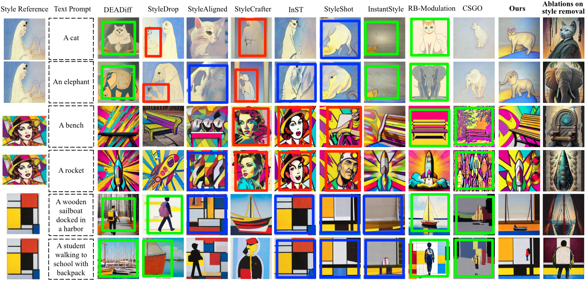
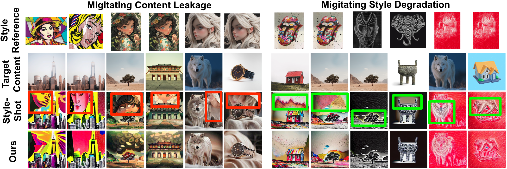
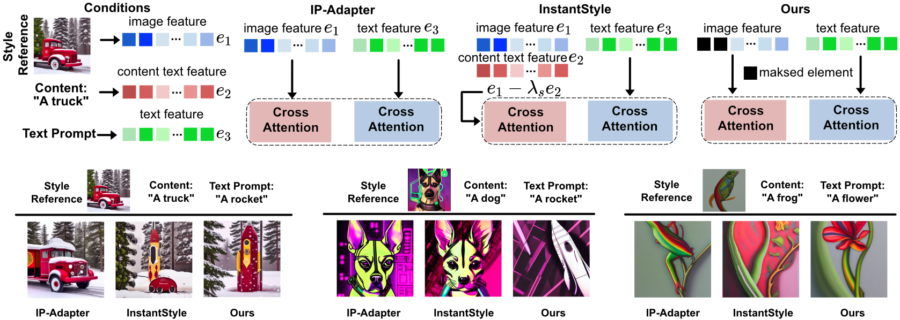
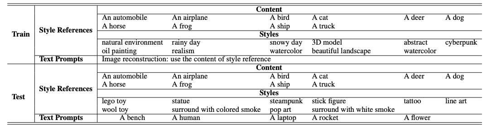
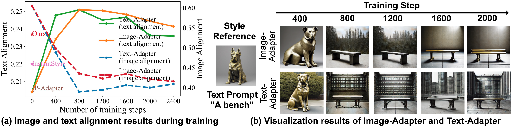

# __***Less is More: Masking Elements in Image Condition Features Avoids Content Leakages in Style Transfer Diffusion Models***__

<div align="center">
_**Lin Zhu, Xinbing Wang, Chenghu Zhou, Qinying Gu, Nanyang Ye**_
<br>

From Shanghai Jiao Tong University and Shanghai AI lab.

</div>

The official implementation of  Less is More: Masking Elements in Image Condition Features Avoids Content Leakages in Style Transfer Diffusion Models (https://openreview.net/forum?id=88JJjsLtqr&referrer=%5BAuthor%20Console%5D(%2Fgroup%3Fid%3DICLR.cc%2F2025%2FConference%2FAuthors%23your-submissions)) 

## Abstract

Given a style-reference image as the additional image condition, text-to-image diffusion models have demonstrated impressive capabilities in generating images that possess the content of text prompts while adopting the visual style of the reference image. However, current state-of-the-art methods often struggle to disentangle content and style from style-reference images, leading to issues such as content leakages. To address this issue, we propose a masking-based method that efficiently decouples content from style without the need of tuning any model parameters. By simply masking specific elements in the style reference’s image features, we uncover a critical yet under-explored principle: guiding with appropriatelyselected fewer conditions (e.g., dropping several image feature elements) can efficiently avoid unwanted content flowing into the diffusion models, enhancing the style transfer performances of text-to-image diffusion models. In this paper, we validate this finding both theoretically and experimentally. Extensive experiments across various styles demonstrate the effectiveness of our masking-based method and support our theoretical results.

## Demos

#### Text-driven style transfer



Given a style-reference image, our method is capable of synthesizing new images that resemble the style and are faithful to text prompts simultaneously. Previous methods often face issues of either content leakages or style degradation. We mark the results with significant <font color="red">content leakages</font>, <font color="green">style degradation</font>, and <font color="blue">loss of text fidelity</font> with <font color="red">red</font>,  <font color="green">green</font>, and<font color="blue"> blue</font> boxes, respectively.

#### Image-driven style transfer



Visual comparison between StyleShot and ours in image-driven style transfer.  We mark the results with significant <font color="red">content leakages</font> and <font color="green">style degradation</font> with <font color="red">red</font> and <font color="green">green</font> boxes, respectively.

## Methods



**Top:** The differences in the conditions between IP-Adapter, InstantStyle, and Ours. **Bottom:** Illustration of the content leakages issue. We propose to eliminate content from the style-reference image by discarding the image feature elements associated with that content. To achieve this, **we mask the content-related elements by setting their values to zero**. The content-related elements are identified through clustering the element-wise product of the style reference image features and the content text features.

## How to Install

Follow [IP-Adapter](https://github.com/tencent-ailab/IP-Adapter?tab=readme-ov-file#download-models) to download pre-trained checkpoints from [here](https://huggingface.co/h94/IP-Adapter).  Follow [StyleShot](https://github.com/open-mmlab/StyleShot) to download pre-trained checkpoints from [here](https://huggingface.co/Gaojunyao/StyleShot/tree/main). 

```shell
# install 
git clone https://github.com/Jeoyal/MaskST.git
cd MaskST

# create conda env
conda create -n MaskST python==3.8
conda activate MaskST
pip install -r requirements.txt

# download the IP-Adapter models
git lfs install
git clone https://huggingface.co/h94/IP-Adapter
mv IP-Adapter/models models
mv IP-Adapter/sdxl_models sdxl_models

# download the StyleShot models
git lfs install
git clone https://huggingface.co/Gaojunyao/StyleShot
git clone https://huggingface.co/Gaojunyao/StyleShot_lineart
```

## Models

To run the demo, you should also download the following models:
- [runwayml/stable-diffusion-v1-5](https://huggingface.co/runwayml/stable-diffusion-v1-5)
- [ControlNet models](https://huggingface.co/lllyasviel)
- [CLIP Model](https://huggingface.co/laion/CLIP-ViT-H-14-laion2B-s32B-b79K)

## Datasets

#### CIFAR-10-based Style References

We construct the evaluation dataset using the 10 classes of CIFAR-10. Leveraging the code of [MACE](https://github.com/Shilin-LU/MACE), we generate 21 distinct styles for each class, each containing 8 variations. The dataset is divided into two subsets based on image style for training and testing. Using these generated images as references, we train tuning-based models (i.e., Image-Adapter and Text-Adapter) through image reconstruction. During inference, we utilize the test dataset as image references to conduct text-driven style transfer for 5 text prompts. Additional details about the datasets are provided in the following Table.



**You can download the style references from [here](https://drive.google.com/drive/folders/100Ua80bXHSKDZyBtCjkdAJ9hKcZ4HS50?usp=drive_link).**

#### StyleBench

To comprehensively evaluate the effectiveness of the proposed masking-based method, we conduct evaluations on the **recent style transfer benchmark <a href='https://drive.google.com/file/d/1Q_jbI25NfqZvuwWv53slmovqyW_L4k2r/view?usp=drive_link'>stylebench</a>** , which covers 40 content images and 73 distinct styles across 490 reference images.

Please make sure that the directory structure of the dataset is arranged as follows:

```
MaskST
    ├── data
      ├── object
      └── object_test
    ├── style_evaluation_benchmark_v2
    └── content
```

## Training on CIFAR-10-based Style References

Using the generated CIFAR-10-based style references, we train tuning-based models (i.e., Image-Adapter and Text-Adapter) through image reconstruction. 

```shell
# training the Image-Adapter.
CUDA_VISIBLE_DEVICES=0 python train_adapter.py --less_condition --output_dir exp1_model/Image_Adapter
# training the Text-Adapter.
CUDA_VISIBLE_DEVICES=0 python train_adapter.py --output_dir exp1_model/Text_Adapter

# Inference Image-Adapter.
bash infer_exp1_adapter.sh 0 true

# Inference Text-Adapter.
bash infer_exp1_adapter.sh 0 
```

Visual comparison between the Image-Adapter and Text-Adapter model. (a) Following (Gao et al., 2024), we report the image and text alignment scores alongside training steps. We also present the tuning-free models’ (i.e., IP-Adapter, InstantStyle, and our masking-based method) fidelity scores in the figure. (b) Visual comparisons between Image-Adapter and Text-Adapter.




## Inference the Tuning-Free Models

Inference on CIFAR-10-based dataset:

```shell
########################## SD v1.5 ###########################
# style transfer using the InstantStyle model under various scales
bash infer_exp1_zs.sh 0 1.0 1 base
bash infer_exp1_zs.sh 0 0.8 1 base
bash infer_exp1_zs.sh 0 0.6 1 base
bash infer_exp1_zs.sh 0 0.4 1 base
bash infer_exp1_zs.sh 0 0.2 1 base
bash infer_exp1_zs.sh 0 1.0 0.8 base
...
# style transfer using the IP-Adapter model under various scales
bash infer_exp1_zs.sh 0 1.0 0 base0
bash infer_exp1_zs.sh 0 0.8 0 base0
bash infer_exp1_zs.sh 0 0.6 0 base0
bash infer_exp1_zs.sh 0 0.4 0 base0
bash infer_exp1_zs.sh 0 0.2 0 base0
# style transfer using our proposed masking method
bash infer_exp1_zs.sh 0 1.0 1 ours true

###################### StyleShot's style encoder ###################
# style transfer using StyleShot
python styleshot_exp1.py --output outputs_exp1 --method styleshot 
# style transfer using InstantStyle's feature subtraction
python styleshot_exp1.py --output outputs_exp1 --method instantstyle 
# style transfer using our proposed masking method
python styleshot_exp1.py --output outputs_exp1 --method ours --less_condition 
```

Inference on stylebench:

```shell
###################### StyleShot's style encoder ###################
# style transfer using StyleShot
python styleshot_text_driven_exp2.py --output outputs_exp2 --method styleshot 
# style transfer using Instantstyle's feature substraction
python styleshot_text_driven_exp2.py --output outputs_exp2 --method instantstyle 
# style transfer using our proposed masking method
python styleshot_text_driven_exp2.py --output outputs_exp2 --method ours --less_condition
```

## Collect Results

Here are some examples to evaluate the generated images. Please make sure you change the path of the generated images in `root_path` and run the commands:

##### CLIP scores:

```shell
python result_text_driven.py --root_path outputs_exp2 --method ours --less_condition
```

##### The proposed metrics:

```shell
python result_exp1.py --root_path outputs_exp1 --method ours --less_condition
```

## Ablation Studies

Inference based on SDXL

```shell
bash infer_exp1_sdxl.sh
```

Image-driven style transfer

```shell
###################### StyleShot's style encoder ###################
# style transfer using StyleShot
python styleshot_image_driven.py --output outputs_image_driven --method styleshot 
# style transfer using Instantstyle's feature substraction
python styleshot_image_driven.py --output outputs_image_driven --method instantstyle 
# style transfer using our proposed masking method
python styleshot_image_driven.py --output outputs_image_driven --method ours --less_condition
```

## Ethics Statement

This work aims to make a positive impact on the field of AI-driven image generation. We aim to facilitate the creation of images with diverse styles, and we expect all related processes to comply with local laws and be used responsibly.**The developers do not assume any responsibility for potential misuse by users.**


## Citation
If you use this code in your research, please kindly cite this paper:
```bibtex
@article{zhu2025moremaskingelementsimage,
      title={Less is More: Masking Elements in Image Condition Features Avoids Content Leakages in Style Transfer Diffusion Models}, 
      author={Lin Zhu and Xinbing Wang and Chenghu Zhou and Qinying Gu and Nanyang Ye},
      year={2025},
      eprint={2502.07466},
      archivePrefix={arXiv},
      primaryClass={cs.CV},
      url={https://arxiv.org/abs/2502.07466}, 
}
```

## Acknowledgements
This repo benefits from [MACE](https://github.com/Shilin-LU/MACE), [IP-Adapter](https://github.com/tencent-ailab/IP-Adapter), [StyleShot](https://github.com/open-mmlab/StyleShot), [InstantStyle](https://github.com/instantX-research/InstantStyle), and [ControlNet](https://github.com/lllyasviel/ControlNet).

The code is built upon <a href='https://github.com/tencent-ailab/IP-Adapter'>IP-Adapter</a>. Thanks for their wonderful works！

## Contact ✉️

If you have any question about this project, please feel free to contact [zhulin_sjtu@sjtu.edu.cn](mailto:zhulin_sjtu@sjtu.edu.cn).
